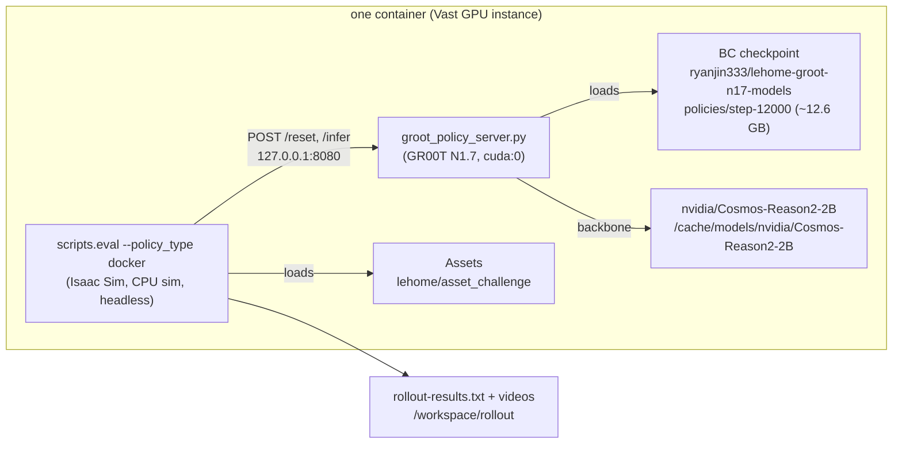

# LeHome GR00T rollout container + Vast template

Self-contained rollout worker for the LeHome Challenge: the official Isaac Sim
5.1 / Isaac Lab / LeRobot simulator plus a pinned Isaac-GR00T N1.7 inference
runtime that serves the initial BC checkpoint from
`ryanjin333/lehome-groot-n17-models` (private, `policies/step-12000`) over
the challenge docker-policy HTTP protocol.



## Why two Python runtimes

The challenge simulator needs Python 3.11 + Isaac Sim 5.1; GR00T N1.7 needs
the pinned Isaac-GR00T checkout (Python 3.10, commit `23ace64`). They do not
share a venv. The GR00T runtime therefore runs as a separate process behind
HTTP, exactly the isolation the challenge's docker-policy submission format
expects — the simulator side stays unmodified upstream code.

## Files

| File | Purpose |
|---|---|
| `Dockerfile` | `lehome-challenge` base + pinned Isaac-GR00T venv at `/opt/gr00t-runtime` + server/entrypoint |
| `groot_policy_server.py` | GR00T checkpoint behind the `/reset` + `/infer` HTTP protocol |
| `entrypoint.sh` | hydrate checkpoint/assets, start server, run headless eval, write results |
| `build.sh` | load official base tarball from HF, build (optionally push) |
| `vast-template.json` | Vast.ai template config (image, disk, env, on-start) |

## Build

```bash
# Downloads the official image tarball from HF on first run (~tens of GB).
# linux/amd64: on Apple Silicon this builds under qemu (slow) — prefer an
# x86_64 Linux host or a disposable Vast instance for the real build.
IMAGE_TAG=ghcr.io/ryanjin333/lehome-rollout:latest ./build.sh

# Push somewhere Vast can pull (Docker Hub / GHCR):
docker push ghcr.io/ryanjin333/lehome-rollout:latest
```

To push with the local build script, you need:

```
PUSH=1 \
  REGISTRY_HOST=ghcr.io \
  REGISTRY_USER=ryanjin333 \
  REGISTRY_TOKEN=<your-personal-ghcr-token> \
  IMAGE_TAG=ghcr.io/ryanjin333/lehome-rollout:latest \
  ./build.sh
```

Token scope requirements for `ghcr.io`:
- `read:packages`
- `write:packages`

If you use `REGISTRY_HOST=ghcr.io`, the image tag must be `ghcr.io/ryanjin333/...` and the token must be valid for that namespace.
```

The BC checkpoint is NOT baked into the image — it hydrates at container
start from the private HF repo, so the image never contains weights and the
template can pin any run by revision.

## Vast template

1. Push the image to a registry Vast can pull, and update
   `image_name` in `vast-template.json` accordingly (digest pin preferred).
2. Create the template from `vast-template.json` (Vast UI → Templates →
   create from JSON, or `vast` CLI).
3. Add `REGISTRY_TOKEN` as the builder instance variable/secret when creating
   `vast-build-template.json`-driven instances, and `HF_TOKEN` as rollout runtime
   variable when renting rollout instances.
   (read scope on `ryanjin333/lehome-groot-n17-policy` is enough). Never bake
   the token into the image.
4. Rent a GPU that passes the rollout gates: 1x RTX A6000 / L40S / RTX 4090 /
   RTX PRO 6000, Isaac Sim 5.1-compatible Vulkan driver, 300 GB disk.

On start, the instance hydrates the checkpoint + assets, serves the policy on
`127.0.0.1:8080`, evaluates `GARMENT_TYPES` headlessly, and writes
`/workspace/rollout/rollout-results.txt` plus logs and videos under
`/workspace/rollout/`.

## Environment variables

| Variable | Default | Meaning |
|---|---|---|
| `HF_TOKEN` | — (required) | HF token for the private policy repo (set once in Vast account env) |
| `POLICY_REPO` | `ryanjin333/lehome-groot-n17-models` | repo holding the BC run |
| `POLICY_REVISION` | `30ac1a84…` (repo head 2026-08-04) | exact commit to hydrate |
| `POLICY_INCLUDE` | `policies/step-12000/*` | `hf download` include pattern |
| `POLICY_MODEL_SUBDIR` | `policies/step-12000` | subdir passed to `Gr00tPolicy(model_path=...)` |
| `BACKBONE_REPO` | `nvidia/Cosmos-Reason2-2B` | GR00T N1.7 VLM backbone (public) |
| `BACKBONE_LOCAL_PATH` | `/cache/models/nvidia/Cosmos-Reason2-2B` | must match `config.model_name` in the checkpoint |
| `GROOT_ACTION_HORIZON` | `40` | trained action horizon (checkpoint config) |
| `GARMENT_TYPES` | all four categories | space-separated eval categories |
| `NUM_EPISODES` / `MAX_STEPS` | `5` / `600` | eval budget per category |
| `SAVE_VIDEO` | `1` | save eval videos |
| `PUSH_REPO` | — | if set, upload results/logs to this HF repo |
| `GROOT_POLICY_DEVICE` | `cuda:0` | inference device |

Manual/debug usage:

```bash
# Inside the instance (ssh):
/usr/local/bin/lehome-rollout-entrypoint server          # policy server only
python -m scripts.eval --policy_type docker \
  --docker_url http://127.0.0.1:8080 --garment_type top_long \
  --num_episodes 2 --enable_cameras --device cpu --headless
```

## Verified against the real repos (2026-08-04)

- `ryanjin333/lehome-groot-n17-models` layout: `policies/step-10000/` and
  `policies/step-12000/` (sharded safetensors + `config.json` +
  `statistics.json` + `processor_config.json`). `step-12000` is the final
  checkpoint of the initial BC run (batch-64 schedule, 12,000 steps);
  `experiments/lifecycle-smoke-*` are test stubs and are not downloaded.
- Checkpoint `config.json` says `action_horizon: 40` and
  `model_name: /cache/models/nvidia/Cosmos-Reason2-2B`; the entrypoint
  hydrates the backbone to exactly that path and serves with horizon 40.

## Known gaps

- The GR00T-to-LeHome observation/action contract (fixed instruction, three
  RGB cameras, 12-D joints) is the checked adapter from the trainer worktree,
  but a one-episode Isaac smoke on a real GPU is still the acceptance gate
  before renting a rollout campaign.
